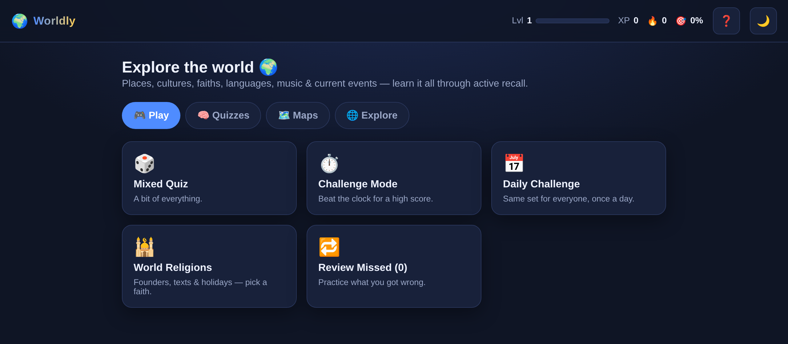

# Worldly 🌍


A polished, no-build **world-knowledge & cultural-awareness** learning game. The
goal isn't just memorising capitals — it's building global literacy: languages,
religions, flags, maps, music, everyday phrases and current events, reinforced
with **active recall** and **spaced repetition** so it actually sticks.

Pure HTML/CSS/vanilla-JS (ES modules). No framework, no build step, no backend,
no accounts, no tracking. All progress is saved locally in your browser. Deploys
as plain static files (Cloudflare Pages / any static host).

**▶ Play it live: [playworldly.pages.dev](https://playworldly.pages.dev)**



## Quick start

Browsers block `fetch()` on `file://`, so serve the folder over HTTP:

```bash
cd Worldly
python3 -m http.server 8000     # or:  npm start
# open http://localhost:8000
```

Run the engine tests (no dependencies — plain `node --test`):

```bash
npm test        # 48 tests over the quiz, SRS and map engines
```

## What's inside

### Quizzes
| Mode | Question |
|------|----------|
| **Country ↔ Capital** | Both directions |
| **Country → Language / Religion** | Most widely spoken language, largest religion |
| **World Religions** | Founders, sacred texts, holidays, symbols, places of worship, origins — study all faiths or focus on one |
| **US / Mexico States → Capitals** | All 50 + all 32 |
| **Flag Mode** | Identify the country from its flag |
| **Historic Flags** | Identify the nation from a flag of the past (34 entities) |
| **Similar Flags** | Tell look-alike flags apart, with tips (12 confusion groups) |
| **Mixed / Challenge / Daily** | Everything shuffled · timed with streak multiplier · one fixed set per day |
| **Custom Study** | Choose topics, continents, difficulty, length — and multiple-choice or **typed answers** |
| **Review Missed** | Practise exactly what you got wrong |

### Interactive maps
Click-the-country (world), click-the-state (US, Mexico), plus **reverse modes**
(a region is highlighted — name it) and **flag crossovers** (see a flag → click
its country, or a country is highlighted → pick its flag). Inline SVG with
pan/zoom and smallest-region hit-testing so nested regions (DC, Andorra…) are
always selectable.

### Explore
- **Phrases** — common phrases & local sayings for 16 countries, with
  text-to-speech pronunciation (Web Speech API, on-device).
- **Music** — 17 countries, 46 songs that represent them, each with a short
  note on *why*, playable via YouTube's privacy-enhanced embed.
- **Crises & Events** — curated, dated background on ongoing world situations
  in two tiers: **Underreported** and **Major Conflicts**, with links to live
  sources (Wikipedia, ReliefWeb, news).

### Learning design
- **Every answer teaches something**: fun fact + *Learn More* links (Wikipedia,
  CIA World Factbook, culture guide) on every question.
- **Spaced repetition**: a Leitner-box scheme (`js/srs.js`) makes forgotten and
  missed items resurface far more often; mastered items get occasional refreshes.
- **Weak-area tracking**: per-category and per-region accuracy, most-missed list,
  one-tap review of your weak spots.
- **Gamification that rewards learning**: XP with a level curve, streaks,
  23 achievements, and a local leaderboard.

## Architecture

No build tooling — the browser loads ES modules directly. Game rules are pure
functions, testable in plain Node, independent of the DOM.

```
Worldly/
├── index.html              # shell: top bar, #app mount, toasts
├── css/styles.css          # themeable design system (dark + light)
├── js/
│   ├── data.js             # loads JSON datasets; flag URLs; lazy map loading
│   ├── state.js            # localStorage profile: XP, streaks, stats, SRS, achievements
│   ├── srs.js              # pure Leitner spaced-repetition picker
│   ├── quiz.js             # pure question-generation engine (all MCQ/typed modes)
│   ├── maps.js             # pure question engine for click-the-map modes
│   ├── mapview.js          # the one DOM-coupled map widget (pan/zoom/hit-test)
│   ├── achievements.js     # achievement evaluation against the profile
│   └── main.js             # controller: routing, rendering, quiz session
├── data/*.json             # countries, states, flags, religions, phrases, music, crises…
├── assets/maps/*.svg       # bundled world/US/Mexico maps (@svg-maps, MIT)
├── tests/*.test.mjs        # 48 Node tests for quiz.js, srs.js, maps.js
├── _headers                # Cloudflare Pages security + caching headers
└── 404.html, robots.txt, site.webmanifest, LICENSE
```

**Why vanilla / no-build?** Longevity and portability — nothing to `npm
install`, no transpiler to age out, deploys anywhere static. The separation of
*pure logic* (`quiz.js`, `srs.js`, `maps.js`) from *rendering* (`main.js`,
`mapview.js`) keeps the core unit-testable.

### Data model
`countries.json` records carry `name, iso2, capital, region, subregion,
population, language, religion, currency, funFact, wiki` (+ optional `note` for
contested facts). Flags render from [flagcdn.com](https://flagcdn.com) by ISO
code; historic flags from Wikimedia Commons. The player profile lives in
`localStorage` under `worldly_profile_v1`.

## Deployment (Cloudflare)

**The git integration is the single deploy path** — pushes to `main` deploy
atomically (CI runs the test suite on every push). Local `wrangler deploy` is
for emergencies only. Caching + security headers (strict CSP, no
`unsafe-inline`) ship in `_headers`; a service worker (`sw.js`) provides
offline resilience and caches flags after first sight.

## Data sources, accuracy & privacy

Facts are curated from public reference data (Wikipedia, CIA World Factbook).
"Primary language" and "largest religion" are deliberate simplifications —
the single most common answer for quiz purposes, not the full picture.
Contested facts carry an inline note (e.g. Jerusalem's disputed status).
Historic flags are shown for educational context only. Crises summaries are
dated, curated background — not live reporting.

**Privacy:** progress is stored only in your browser; no accounts. Anonymous
usage analytics via Microsoft Clarity (which screens/modes get used — never
names, answers or saved progress). Music uses YouTube's privacy-enhanced
(nocookie) embed.

Corrections welcome — everything lives in `data/*.json` and needs no code
changes to extend.

## Extending it

- **Add a country / state / song / crisis:** append an object to the relevant
  JSON file — it joins every relevant mode automatically.
- **Add an achievement:** add a definition to `achievements.json`; new `type`s
  need one case in `progressFor()` (`js/achievements.js`).
- **Add a quiz mode:** an entry in `MODES` + a `case` in `makeQuestion()`
  (`js/quiz.js`), then a card in `MODE_CARDS` (`js/main.js`).

## Credits

Map SVGs adapted from [@svg-maps](https://github.com/VictorCazanave/svg-maps)
(MIT) · flags by [flagcdn.com](https://flagcdn.com) · historic flag images from
[Wikimedia Commons](https://commons.wikimedia.org) · facts from Wikipedia & the
CIA World Factbook · music via embedded YouTube (all rights remain with the
artists and labels).

## License

MIT — see [LICENSE](LICENSE).
