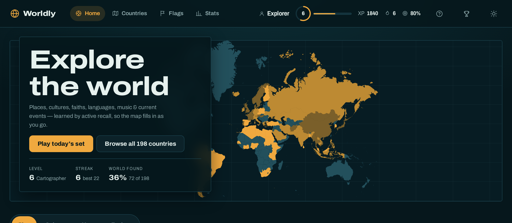

# Worldly 🌍


A polished, no-build **world-knowledge & cultural-awareness** learning game. The
goal isn't just memorising capitals — it's building global literacy: languages,
religions, flags, maps, music, everyday phrases and current events, reinforced
with **active recall** and **spaced repetition** so it actually sticks.

Pure HTML/CSS/vanilla-JS (ES modules). No framework, no build step, no backend,
no accounts, no tracking. All progress is saved locally in your browser. Deploys
as plain static files (Cloudflare Pages / any static host).

**▶ Play it live: [playworldly.pages.dev](https://playworldly.pages.dev)**



## Quick start

Browsers block `fetch()` on `file://`, so serve the folder over HTTP:

```bash
cd Worldly
python3 -m http.server 8000     # or:  npm start
# open http://localhost:8000
```

Run the engine tests (no dependencies — plain `node --test`):

```bash
npm test        # Node tests over the quiz, SRS, map, router, language and Pokédex
                # logic, plus integrity checks on the real data/ files
```

## What's inside

### Quizzes
| Mode | Question |
|------|----------|
| **Country ↔ Capital** | Both directions |
| **Country → Language / Religion** | Most widely spoken language, largest religion |
| **Country → Currency / Population** | Official currency, population (comma-formatted) |
| **World Religions** | Founders, sacred texts, holidays, symbols, places of worship, origins — study all faiths or focus on one |
| **US / Mexico / Canada States → Capitals** | All 50 + all 32 + all 13 |
| **Flag Mode** | Identify the country from its flag |
| **Historic Flags** | Identify the nation from a flag of the past (34 entities) |
| **Similar Flags** | Tell look-alike flags apart, with tips (12 confusion groups) |
| **Mixed / Challenge / Daily** | Everything shuffled · timed with streak multiplier · one fixed set per day |
| **Custom Study** | Choose topics, continents, difficulty, length — and multiple-choice or **typed answers** |
| **Review Missed** | Practice exactly what you got wrong |

### Interactive maps
Click-the-country (world), click-the-state (US, Mexico, Canada), plus
**reverse modes** (a region is highlighted — name it) and **flag crossovers**
(see a flag → click its country, or a country is highlighted → pick its
flag). A **Regions & Continents** mode lets you pick one continent — the
world map zooms into just that part of the world. Inline SVG with pan/zoom
and smallest-region hit-testing so nested regions (DC, Andorra…) are always
selectable.

### Explore
- **Language Map** — the whole world coloured by what it actually speaks, either
  by language family or by the ten most widespread languages. Tap a key entry to
  show only that group; tap a country to open its page.
- **Say Hello** — tap any country and get its greeting in the local script, with
  a pronunciation guide, a literal gloss, two more phrases and a note on how the
  greeting is actually done (bow, handshake, cheek kisses).
- **Country Guides** — a page for every one of the 198 countries: the greeting,
  fast facts, five people it is known for, the events that shaped it, a short
  read on its culture, three things worth bringing up and one to tread carefully
  around.
- **Phrases** — common phrases & local sayings for 16 countries, with
  text-to-speech pronunciation (Web Speech API, on-device).
- **Music** — 17 countries, 46 songs that represent them, each with a short
  note on *why*, playable via YouTube's privacy-enhanced embed.
- **Crises & Events** — curated, dated background on ongoing world situations
  in two tiers: **Underreported** and **Major Conflicts**, with links to live
  sources (Wikipedia, ReliefWeb, news).
- **Flag Key** — a browsable reference (not a quiz) of every country, US
  state, and Mexican state by flag and name, with live search and a region
  filter on each tab.

### Pokédex (a fun corner)
All 1025 Pokémon, browsable by generation with search and a type filter, plus
seven practice modes (*Who's That Pokémon?*, typing, dex entries, generation,
evolution, base stats, type matchups). Identify one correctly and it is
**registered** to your dex; get it right three times running and it is
**mastered**. Dex completion drives a trainer rank that tops out at *Pokémon
Master*, so it is earned only by actually knowing them.

It is deliberately a **separate sandbox**: progress lives under its own
`worldly_pokedex_v1` key and never touches your Worldly XP, level, streak,
achievements or the leaderboard. Data and sprites are bundled locally, so it
needs no network and adds nothing to the CSP.

### Learning design
- **Every answer teaches something**: fun fact + *Learn More* links (Wikipedia,
  CIA World Factbook, culture guide) on every question.
- **Spaced repetition**: a Leitner-box scheme (`js/srs.js`) makes forgotten and
  missed items resurface far more often; mastered items get occasional refreshes.
- **Weak-area tracking**: per-category and per-region accuracy, most-missed list,
  one-tap review of your weak spots.
- **Gamification that rewards learning**: XP with a level curve, streaks,
  23 achievements, and a local leaderboard.

## Architecture

No build tooling — the browser loads ES modules directly. Game rules are pure
functions, testable in plain Node, independent of the DOM.

```
Worldly/
├── index.html              # shell: top bar, #app mount, toasts
├── css/styles.css          # themeable design system (dark + light)
├── js/
│   ├── data.js             # loads JSON datasets; flag URLs; lazy map loading
│   ├── state.js            # localStorage profile: XP, streaks, stats, SRS, achievements
│   ├── srs.js              # pure Leitner spaced-repetition picker
│   ├── quiz.js             # pure question-generation engine (all MCQ/typed modes)
│   ├── maps.js             # pure question engine for click-the-map modes
│   ├── languages.js        # pure bucketing/paint logic for the language choropleth
│   ├── culture.js          # pure lookup helpers for the country guide pages
│   ├── mapview.js          # the one DOM-coupled map widget (pan/zoom/hit-test)
│   ├── achievements.js     # achievement evaluation against the profile
│   ├── pokedex.js          # pure question engine for the Pokédex practice modes
│   ├── pokestate.js        # Pokédex progress (its own localStorage key)
│   ├── pokedexview.js      # the Pokédex screens (helpers injected by main.js)
│   ├── router.js           # tiny History-API router (screen-agnostic; matchPath is unit-tested)
│   └── main.js             # controller: route table, rendering, quiz session
├── data/*.json             # countries, states, flags, religions, phrases, music, crises,
│                           # greetings (all 256 map regions), pokemon
├── data/culture/*.json     # per-country deep dives, one file per region
├── assets/maps/*.svg       # bundled world/US/Mexico/Canada maps (@svg-maps, CC BY / CC BY-NC)
├── assets/pokemon/*.png    # 1025 bundled sprites (~1.1 MB) — generated, see scripts/
├── scripts/build-pokedex.mjs  # dev-only: regenerates the dex data + sprites from PokéAPI
├── tests/*.test.mjs        # 147 Node tests for quiz.js, srs.js, maps.js, router.js, pokedex.js…
├── tests/e2e/*.spec.js     # 45 Playwright specs (screens, quiz, flag key, routing)
├── _headers                # Cloudflare Pages security + caching headers
└── robots.txt, sitemap.xml, site.webmanifest, LICENSE
```

**Routing.** Every screen has a real URL (`/`, `/flags`, `/leaderboard`,
`/quiz/:mode`, `/map/:mode`, `/crises/:slug`, …) via the History API, so Back /
Forward, bookmarks and deep links work. On Cloudflare Pages this needs no config
beyond *not* shipping a top-level `404.html`: Pages then serves the app shell for
any unmatched path (SPA fallback), with Functions (`/api/*`) and real static
assets still matched first. Unknown paths render an in-app 404 tagged `noindex`.
Because asset URLs must resolve from multi-segment routes, all asset/`fetch`
paths are root-absolute (a `<base>` tag would collide with the CSP's
`base-uri 'none'`).

**Why vanilla / no-build?** Longevity and portability — nothing to `npm
install`, no transpiler to age out, deploys anywhere static. The separation of
*pure logic* (`quiz.js`, `srs.js`, `maps.js`) from *rendering* (`main.js`,
`mapview.js`) keeps the core unit-testable.

### Data model
`countries.json` records carry `name, iso2, capital, region, subregion,
population, language, religion, currency, funFact, history, wiki` (+ optional
`note` for contested facts). `history` is a one-sentence founding/independence
note (who from, and when) shown alongside the fun fact on the reveal screen.
Flags render from [flagcdn.com](https://flagcdn.com) by ISO code; historic
flags from Wikimedia Commons. The player profile lives in `localStorage` under
`worldly_profile_v1`.

## Deployment (Cloudflare)

The live site (`playworldly.pages.dev`) is a Cloudflare Pages project.
**Merging to `main` deploys it** — `.github/workflows/deploy.yml` runs the
engine tests and then uploads the tree, so the commit CI tested is always the
commit serving traffic. Nothing else should publish.

Rollback is "Retry deployment" on any earlier entry in the Cloudflare Pages
dashboard; each deployment records the commit it came from.

The workflow needs two repository secrets — `CLOUDFLARE_API_TOKEN` (with the
*Cloudflare Pages: Edit* permission) and `CLOUDFLARE_ACCOUNT_ID`. To deploy by
hand in an emergency, `npm run deploy`.

(A separate, legacy Cloudflare Worker is still git-connected for historical
reasons — its "Workers Builds" check on GitHub is unrelated to the live site
and safe to ignore.) Caching + security headers (strict CSP, no
`unsafe-inline`) ship in `_headers`; a service worker (`sw.js`) provides
offline resilience and caches flags after first sight.

## Data sources, accuracy & privacy

Facts are curated from public reference data (Wikipedia, CIA World Factbook).
"Primary language" and "largest religion" are deliberate simplifications —
the single most common answer for quiz purposes, not the full picture.
Contested facts carry an inline note (e.g. Jerusalem's disputed status).
Historic flags are shown for educational context only. Crises summaries are
dated, curated background — not live reporting.

**Privacy:** progress is stored only in your browser; no accounts. Anonymous
usage analytics via Microsoft Clarity (which screens/modes get used — never
names, answers or saved progress). Music uses YouTube's privacy-enhanced
(nocookie) embed.

Corrections welcome — everything lives in `data/*.json` and needs no code
changes to extend.

## Extending it

- **Add a country / state / song / crisis:** append an object to the relevant
  JSON file — it joins every relevant mode automatically.
- **Add an achievement:** add a definition to `achievements.json`; new `type`s
  need one case in `progressFor()` (`js/achievements.js`).
- **Add a quiz mode:** an entry in `MODES` + a `case` in `makeQuestion()`
  (`js/quiz.js`), then a card in `MODE_CARDS` (`js/main.js`).
- **Regenerate the Pokédex:** `node scripts/build-pokedex.mjs` rewrites
  `data/pokemon.json`, `data/pokemon_types.json` and `assets/pokemon/*.png`
  from PokéAPI. It caches responses under `scripts/.cache/`, so a re-run is
  cheap and an interrupted run resumes.

## Credits

Map SVGs adapted from [@svg-maps](https://github.com/VictorCazanave/svg-maps)
(world/Mexico/Canada: CC BY 4.0 · USA: CC BY-NC 4.0) · flags by
[flagcdn.com](https://flagcdn.com) · historic flag images from
[Wikimedia Commons](https://commons.wikimedia.org) · facts from Wikipedia & the
CIA World Factbook · music via embedded YouTube (all rights remain with the
artists and labels) · Pokédex data and sprites from [PokéAPI](https://pokeapi.co).
Pokémon and Pokémon character names are trademarks of Nintendo, Creatures Inc.
and GAME FREAK Inc.; the Pokédex is an unofficial, non-commercial fan feature,
not affiliated with or endorsed by them.

## License

MIT — see [LICENSE](LICENSE).
